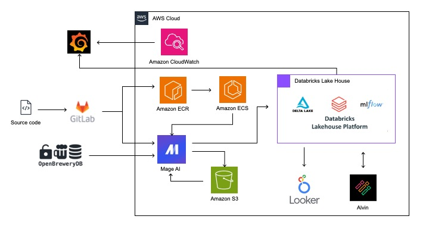

# Brewery_Project

This repository aims to build a solution for the following challenge: "Extract data from the Open Brewery DB API (https://www.openbrewerydb.org/), use Mage (https://github.com/mage-ai/mage-ai) for data extraction and processing. The raw data will be stored in the Bronze layer as a JSON file, transformed into columnar storage in Parquet format in the Silver layer, and an aggregation of breweries by type and location will be created in the Gold layer. The solution includes a Docker container with the entire setup, and the results are mocked in a pseudo S3, which is a directory named ./S3 within the container."

## Execution Scripts

To run the solution, follow the steps below:

1. Clone the repository:

   ```bash
   git clone https://github.com/lecarnevali/Brewery_Project.git
   cd Brewery_Project

2. Build the Docker running this shell script in the repository directory:

   ```bash
   ./build_and_run.sh

3. Accessing the Solution:

  * If you want to use the user interface (UI) or schedule the execution:
  Open your browser and visit http://localhost:6789

  * If you want to execute the solution ad-hoc via command line:
  Run the following command in the root directory:

      ```bash
      mage run Mage-Development brewery

## Mage Repository

The Docker container in this repository uses the Mage repository located at https://github.com/lecarnevali/Mage-Development.

## Proposed Cloud Architecture

For a scalable and robust solution in a corporate environment, the following cloud architecture is proposed:

